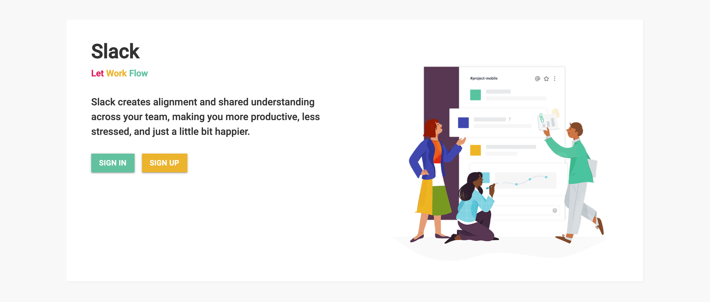
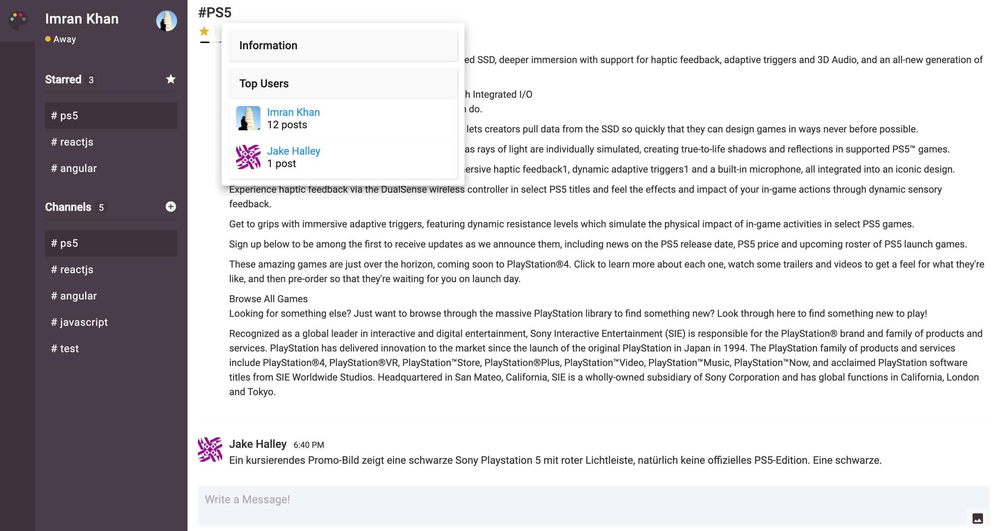

# Slack App Clone
A Full-stack Chat application from Frontend to Backend with React, Redux, Firebase, and custom SCSS Framework.
- State management with Redux, with simple, straightforward patterns
- Essential features of React Router 4 (Switch component, withRouter HOC, History object)
- Support Internationalization (i18n)
- User authentication with Firebase (Register & Login)
- Form validations for our Register & Login forms
- Create Public Channels
- Send and receive messages instantly with the real-time Firebase Database
- Upload and Display image in messages using Firebase Storage
- Starred / un-starred public channels
- Show Channel Information with top active users
- Create and Upload user avatars
- Allow user to change their status: Active, Away, Busy, Offline
- Change App theme using React Color picker

	

	

## Content
- [X] Authentication with Firebase
	- Sign-up with Form Validation
	- Login with Form Validation
- [X] Implement Public Channels
- [X] Implement Message System
	- Add Message to a Channel
	- Show a List of Messages in a Channel
		- Layout Design
		- Implement Infinite Scrolling
	- Add Image with Message to a Channel
- [X] Add User Status
- [X] Add Colors
- [X] Starred/Un-starred Public Channels
- [X] Show Channel Information
	- Show Top Posters
	- Channel Description

## Libraries and Frameworks
#### Internal
- [X] [SCSS Framework](https://github.com/imransilvake/SCSS-Framework)

#### External 
- [X] [Create React App](https://github.com/facebook/create-react-app)
- [X] [Redux](https://redux.js.org/)
- [X] [Redux Devtools Extension](https://github.com/zalmoxisus/redux-devtools-extension)
- [X] [Translation](https://github.com/i18next/react-i18next)
- [X] [Firebase](https://firebase.google.com/)
- [X] [Material-UI](https://material-ui.com/)
- [X] [Lodash](https://github.com/lodash/lodash)
- [X] [Moment](https://momentjs.com/)
- [X] [Classnames](https://github.com/JedWatson/classnames)
- [X] [React Scroll](https://github.com/fisshy/react-scroll)
- [X] [React Color](https://casesandberg.github.io/react-color/)

## Information
Check [React-Seed](https://github.com/imransilvake/React-Seed) to understand how to build and serve this project as well as how to use SCSS and JS linting.
